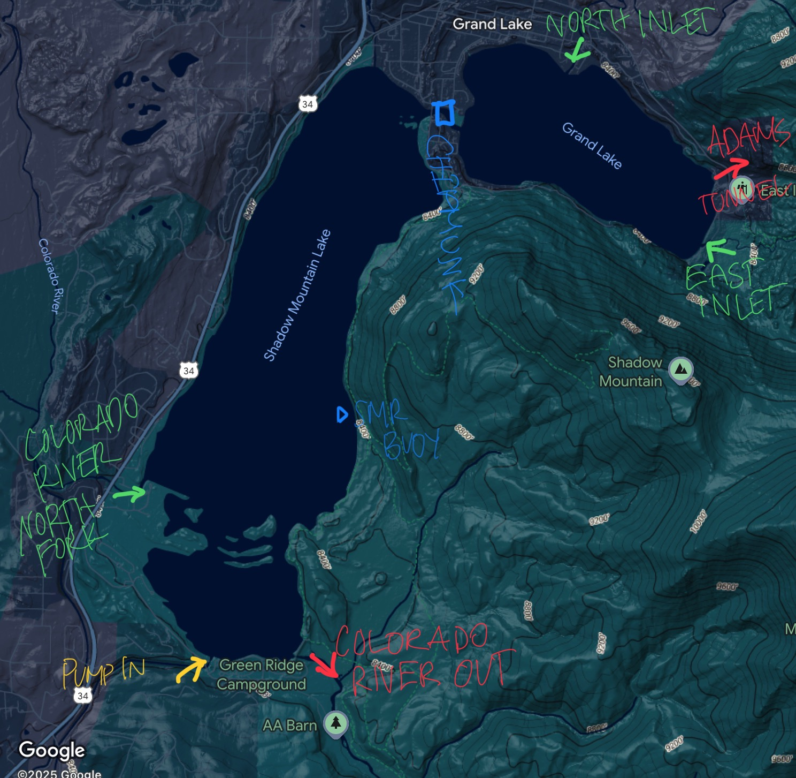

# TLS_DSS/data_submodule

The data submodule of the TLS DSS stores and integrates data used in the model and knowledge engine subsystems.

## Inflow Balance

The decision for pump operation is made within the context of natural inflow.

